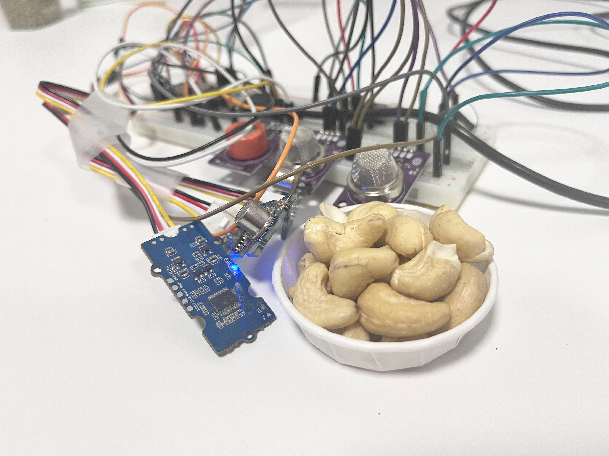
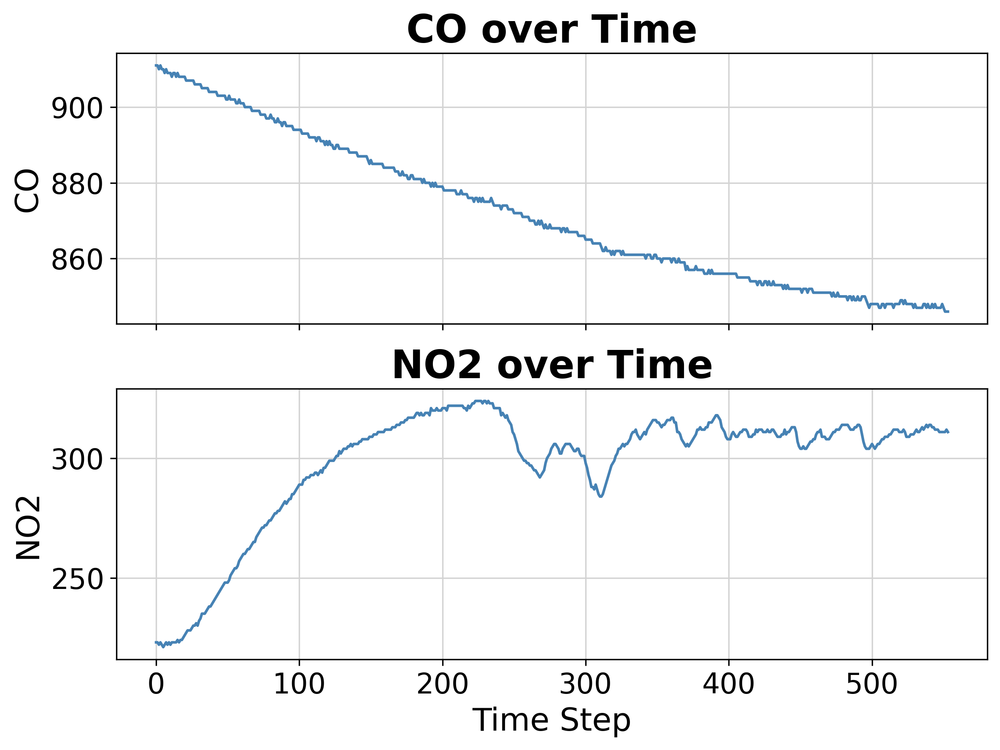
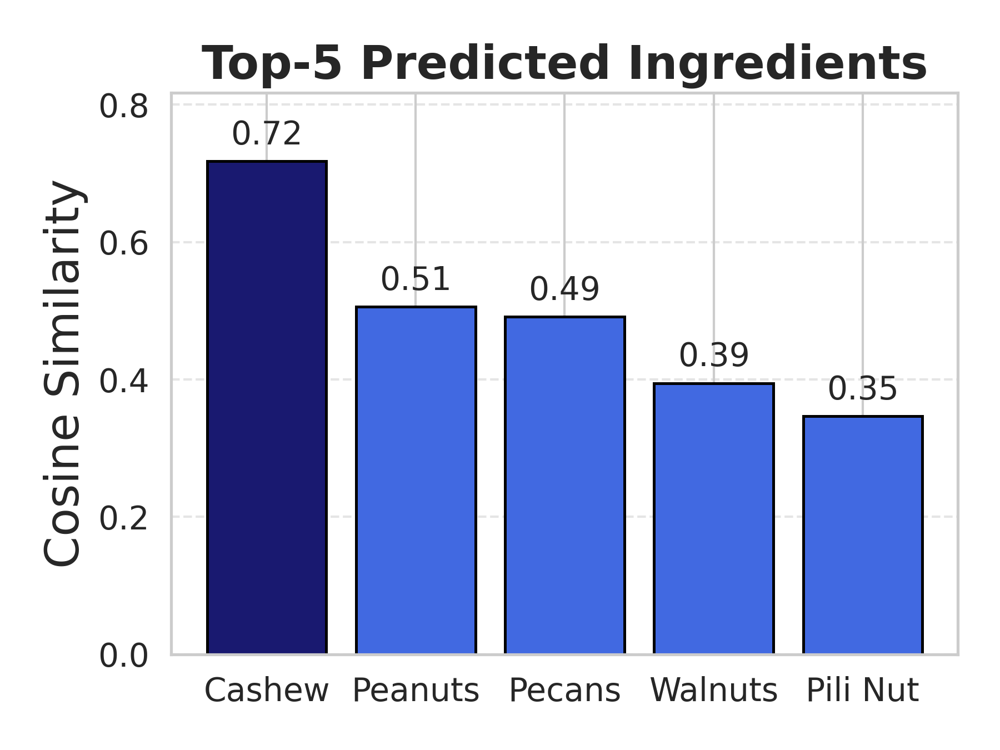
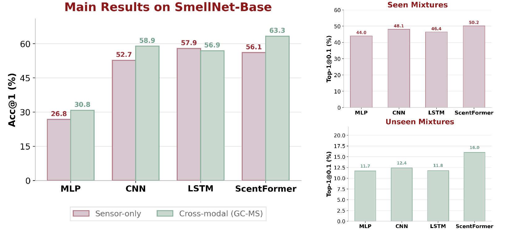
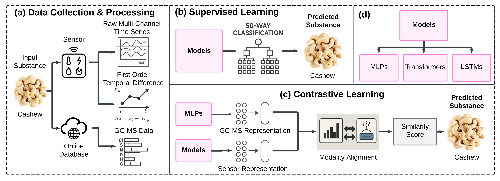

# SmellNet: A Large-scale Dataset for Real-world Smell Recognition

<p align="center">
  <a href="assets/cashew.jpg"></a>
  <a href="assets/CO_NO2_timeseries.png"></a>
  <a href="assets/model_predictions.png"></a>
  <em>Overview of the smell sensing and modeling pipeline: hardware setup, multichannel sensor responses, and example model predictions.</em>
</p>

<p align="center">
  <a href="https://arxiv.org/abs/2506.00239">Paper</a> •
  <a href="https://huggingface.co/datasets/DeweiFeng/SmellNet/tree/main">Dataset</a> •
  <a href="https://iclr.cc/media/PosterPDFs/ICLR%202026/10008694.png?t=1776021318.4790535">Poster</a> •
  <a href="https://github.com/MIT-MI/SmellNet">Code</a> • 
  <a href="https://www.youtube.com/watch?v=F-emEVOO9jo">Demo</a>
</p>

SmellNet is a benchmark for **sensor-based machine olfaction** built from **portable low-cost MOX gas sensors**. It supports both **single-substance recognition** and **mixture prediction**, and introduces **ScentFormer**, a temporal model for learning from multichannel smell sensor time series with optional **training-time GC-MS supervision**.

## Highlights

- **828K** sensor timesteps
- **50** base substances across nuts, spices, herbs, fruits, and vegetables
- **43** controlled mixtures
- **68 hours** of recordings
- Benchmark tasks for both **classification** and **mixture-ratio prediction**
- Optional **sensor-chemistry alignment** using ingredient-level **GC-MS** representations

## Main Results

ScentFormer achieves:

- **63.3% Top-1 accuracy** on **SmellNet-Base** with GC-MS supervision
- **50.2% Top-1@0.1** on **seen mixtures**
- **16.0% Top-1@0.1** on **unseen mixtures**

<p align="center">
  
  <br/>
  <em>Main benchmark results: SmellNet-Base and mixture tasks.</em>
</p>

These results show that temporal modeling is effective for smell recognition, while **generalization to unseen mixtures remains a core challenge**.

## What is in this repository?

This repository contains:

- code for training and evaluating smell-recognition models
- preprocessing and analysis utilities for sensor data
- GC-MS processing pipelines for cross-modal supervision
- Arduino and data-collection utilities used in the sensing setup
- scripts for reproducing main experiments and regenerating figures

**Large files (sensor recordings, `gcms_processed/`, etc.) are not stored in Git.** Download them from the [SmellNet dataset on Hugging Face](https://huggingface.co/datasets/DeweiFeng/smell-net/tree/main) and place them in the paths described in [Quick Start](#quick-start) so scripts can find them locally.

## Benchmark Tasks

### SmellNet-Base

A **50-way classification** benchmark for recognizing single substances from multichannel sensor time series.

### SmellNet-Mixture

A benchmark for predicting **normalized mixture ratios** over 12 base odorants, including:

- **seen mixtures**: known combinations under new recording sessions
- **unseen mixtures**: novel combinations for compositional generalization

## Method Overview

The overall pipeline is:

1. collect multichannel sensor responses from portable MOX sensors
2. optionally apply **temporal differencing** to emphasize signal dynamics
3. segment the signal into **sliding windows**
4. train temporal models such as **CNNs, LSTMs, and ScentFormer**
5. optionally align sensor embeddings with **ingredient-level GC-MS embeddings** during training

<p align="center">
  
</p>

## Quick Start

### 1) Clone the repository

```bash
git clone https://github.com/MIT-MI/SmellNet.git
cd SmellNet
```

### 2) Install a minimal environment

```bash
pip install -r requirements.txt
```

This installs dependencies for training, analysis, and optional tools (serial capture, t-SNE/UMAP, Plotly). If you only need a minimal stack, you can install the core packages by hand (`torch`, `pandas`, `numpy`, `scikit-learn`, `matplotlib`). For a particular **CUDA** version of PyTorch, install `torch` from [pytorch.org](https://pytorch.org/) first, then run `pip install -r requirements.txt` (pip will keep your existing torch if it satisfies the constraint).

### 3) Download the dataset

Download the released files from **[Hugging Face — `DeweiFeng/smell-net`](https://huggingface.co/datasets/DeweiFeng/smell-net/tree/main)** and unpack them into this clone. The dataset card lists archives and filenames.

## Running Experiments

### SmellNet-Base classification / contrastive training

```bash
cd models
python run.py \
  --train-dir ../base_data/training \
  --test-dir ../base_data/testing \
  --real-test-dir ../base_data/testing \
  --gcms-csv ../gcms_processed/gcms_food_vectors.csv \
  --models transformer \
  --epochs 90 \
  --batch-size 32 \
  --lr 0.001
```

For fuller sweeps, see:

- `scripts/run_experiment.bash`
- `scripts/run_experiments.sh`

### Mixture prediction

Use:

- `models/run_mixture.py`

and the commented mixture template in:

- `scripts/run_experiment.bash`

## Repository Structure

```text
models/           training and evaluation code
scripts/          experiment wrappers and figure-generation utilities
analysis/         notebooks and analysis scripts
base_data/        SmellNet-Base sensor CSVs (training/testing; not in git — download from Hugging Face)
gcms_processed/   GC-MS vectors (not in git; download from Hugging Face)
gcms_analysis/    scripts to build GC-MS embeddings (outputs go to gcms_processed/)
data_collection/  acquisition helpers and sensor-side tooling
data_stats/       summary plots and tables
figures/paper/    regenerated paper figures
preprocessing/    raw-to-structured data utilities
Arduino/          firmware and sensor libraries
```

## Applications

SmellNet can support research and prototyping in:

- machine olfaction
- food and beverage monitoring
- allergen-relevant sensing
- multimodal sensing
- environmental and industrial monitoring
- digital olfaction and human-AI interaction

## Citation

If you use SmellNet in your work, please cite:

```bibtex
@inproceedings{feng2026smellnet,
  title={SmellNet: A Large-Scale Dataset for Real-World Smell Recognition},
  author={Feng, Dewei and Dai, Wei and Li, Carol and Pernigo, Alistair and Liang, Paul Pu},
  booktitle={International Conference on Learning Representations (ICLR)},
  year={2026}
}
```

## Contact

For questions or collaboration, please contact **Dewei Feng** at **dewei@mit.edu**.
